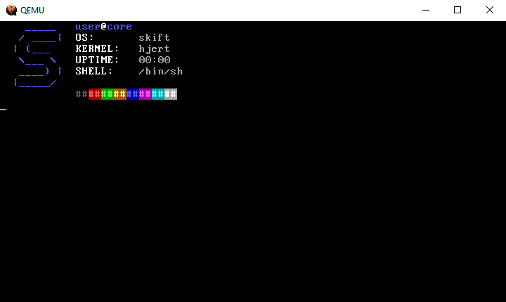

# vtconsole
A **ansi** escape code parser and renderer for hobby operating systems.

## 👨‍🏫 Exemple

### 👨‍💻 C code
```c
print("\033[1;34m    _____   \033[1;34muser\033[1;37m@\033[1;34mcore\n");
print("\033[1;34m   / ____|  \033[1;37mOS:       \033[0;37mskift\n");
print("\033[1;34m  | (___    \033[1;37mKERNEL:   \033[0;37mhjert\n");
print("\033[1;34m   \\___ \\   \033[1;37mUPTIME:   \033[0;37m00:00\n");
print("\033[1;34m   ____) |  \033[1;37mSHELL:    \033[0;37m/bin/sh\n");
print("\033[1;34m  |_____/   \n");
print("\033[1;34m            \033[1;30;40m##\033[1;41;31m##\033[1;42;32m##\033[1;43;33m##\033[1;44;34m##\033[1;45;35m##\033[1;46;36m##\033[1;47;37m##\033[0m\n");
```

### 💻 Result


The kernel use for this exemple is the a barebone kernel from [Kernels 101 –
Let’s write a Kernel](https://arjunsreedharan.org/post/82710718100/kernels-101-lets-write-a-kernel) located in the **exemple** directory.


## ✨ Features (description from [wikipedia](https://en.wikipedia.org/wiki/ANSI_escape_code))

- CSI sequences `\033[`
- `CSI n ; m H` CUP – Cursor Position
  >Moves the cursor to row n, column m. The values are 1-based, and default to 1 (top left corner) if omitted. A sequence such as CSI ;5H is a synonym for CSI 1;5H as well as CSI 17;H is the same as CSI 17H and CSI 17;1H
- `CSI n J` ED – Erase in Display
    > Clears part of the screen. If n is 0 (or missing), clear from cursor to end of screen. If n is 1, clear from cursor to beginning of the screen. If n is 2, clear entire screen (and moves cursor to upper left on DOS ANSI.SYS). If n is 3, clear entire screen and delete all lines saved in the scrollback buffer (this feature was added for xterm and is supported by other terminal applications).
- `CSI n K` EL – Erase in Line
    > Erases part of the line. If n is 0 (or missing), clear from cursor to the end of the line. If n is 1, clear from cursor to beginning of the line. If n is 2, clear entire line. Cursor position does not change.
- `CSI n m` SGR – Select Graphic Rendition
    > Sets the appearance of the following characters, see SGR parameters below.

## Supported SGR parameters

| code  | effet                             |
| ----- | --------------------------------- |
| 0     | Reset / Normal	all attributes off |
| 1     | Bold or increased intensity       |
| 30–37 | Set foreground color              |
| 40–47 | Set background color              |

## 🎨 Supported Colors

| name    | id  | color                                              |
| ------- | --- | -------------------------------------------------- |
| Black   | 0   |  |
| Red     | 1   |  |
| Green   | 2   |  |
| Yellow  | 3   |  |
| Blue    | 4   |  |
| Magenta | 5   |  |
| Cyan    | 6   |  |
| White   | 7   |  |

## 👐 Contributing
Feel free to open an issue or a pull request if you would like to contribute or ask a question.

## ✌ Thanks

- To [https://github.com/64/cansid]() which this project was originaly based on